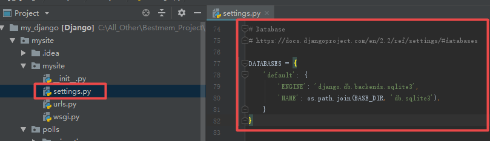
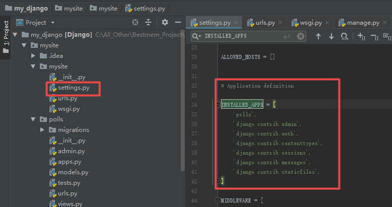

# 数据库的配置

Dajango自带ORM层，因此我们可以很轻松的将默认使用的sqlite数据库改为我们想使用的mysql数据库，操作步骤如下：

1、在项目工程的settions.py文件中找到Database，进行修改



2、配置setting.py文件

本地数据库信息

| IP        | User | Password | Port |
| --------- | ---- | -------- | ---- |
| 127.0.0.1 | root | Lwc@2019 | 3306 |

```python
import pymysql
# Database1
# Use local mysql
pymysql.install_as_MySQLdb()

DATABASES = {
    'default': {
        'ENGINE': 'django.db.backends.mysql',
        'NAME': 'mysite',
        'HOST': '127.0.0.1',
        'USER': 'root',
        'PASSWORD': 'Lwc@2019',
        'PORT': '3306'
    }
}
```

也可以将`import pymysql` ,`pymysql.install_as_MySQLdb()`单独写在工程的__init__.py文件中。

3、手动创建misite数据库

```powershell
mysql> create database mysite defautlt utf8 ;
```

4、建立APP对应的数据表

在settiing.py中`INSTALLED_APPS`代表了已经注册在django项目中的app，我们自建创建的app也要注册在内，如polls，是我们自己的app。



系统默认的app（应用）有以下：

| app                         | 作用          |
| --------------------------- | ----------- |
| django.contrib.admin        | admin管理后台站点 |
| django.contrib.auth         | 身份认证系统      |
| django.contrib.contenttypes | 内容类型框架      |
| django.contrib.sessions     | 会话框架        |
| django.contrib.messages     | 消息框架        |
| django.contrib.staticfiles  | 静态文件管理框架    |

自定义的app：

| app   | 作用     |
| ----- | ------ |
| polls | 返回简单页面 |

所以我们需要知道，我们的app（应用）是独立于一个工程的，可以通过注册的方式将其用于任何一个其他的工程。

系统默认或自己创建的app在使用前，会需要使用一些数据表，我们通过以下命令让数据库去创建所需要的数据表：

```python
python manage.py migrate
```

> migrate命令将遍历`INSTALLED_APPS`设置中的所有项目，在数据库中创建对应的表，

查看数据库

```sql
mysql> show tables;
+----------------------------+
| Tables_in_mysite           |
+----------------------------+
| auth_group                 |
| auth_group_permissions     |
| auth_permission            |
| auth_user                  |
| auth_user_groups           |
| auth_user_user_permissions |
| django_admin_log           |
| django_content_type        |
| django_migrations          |
| django_session             |
+----------------------------+
10 rows in set (0.00 sec)
```

常用命令

```python
# 将数据迁移记录在迁移文件中，并未实际迁移
python manager.py makemigrations polls
# 查看迁移文件中生成的sql语句
python manager.py sqlmigrate polls 0001
# 应用迁移文件，在数据库中生成对应的数据表
python manager.py migrate polls
# 检查项目中的错误，并不实际进行迁移或者链接数据库的操作
python manager.py check polls
```
