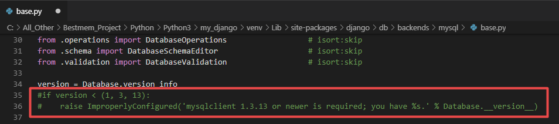
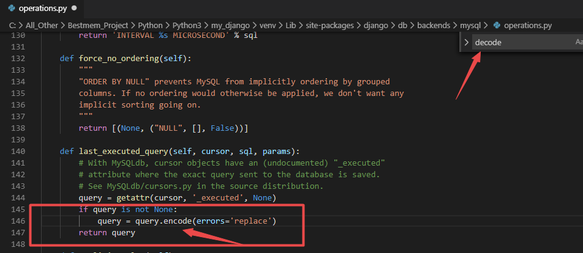
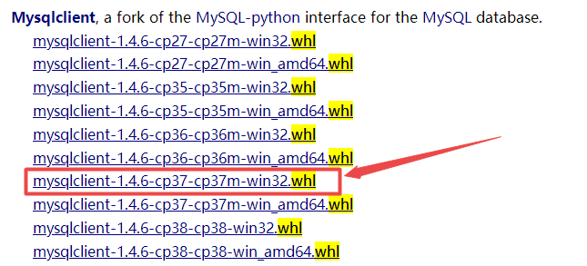
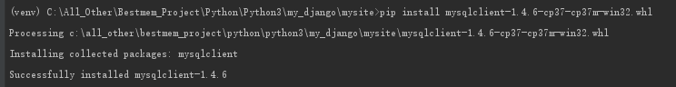

# # 提供在Django使用过程的错误解决方式

## ## 1、使用pymysql创建django系统app数据表报错

**报错信息：**

```python
(venv)C:\All_Other\Bestmem_Project\Python\Python3\my_django\mysite>python manage.py migrate
......
django.core.exceptions.ImproperlyConfigured: mysqlclient 1.3.13 or newer is required; you have 0.9.3.
```

**分析：**

django连接mysql时默认使用MySQLdb驱动，但MySQLdb不支持Python3，因此这里将MySQL驱动设置为pymysql，使用 pip install pymysql 进行安装，然后在工程文件`__init__.py`添加以下代码

```python
import pymysql
pymysql.install_as_MySQLdb()
```

对于pymysql版本过低的解决方式：

1、我们使用的django版本过高，可以通过降低django版本至2.1.4版本来解决此问题

2、修改django的mysql模块配置文件base.py

```powershell
C:\All_Other\Bestmem_Project\Python\Python3\my_django\venv\Lib\site-packages\django\db\backends\mysql\base.py
```



注释掉35、36行。

再运行，会报错

```python
AttributeError: 'str' object has no attribute 'decode'
```

修改django的mysql模块配置文件operations.py

```powershell
C:\All_Other\Bestmem_Project\Python\Python3\my_django\venv\Lib\site-packages\django\db\backends\mysql\operations.py
```

通过查找decode，将其改为encode即可。



即可解决！！！

## ## 2、安装部分模块时报错Microsoft Visual C++ 14.0 is required

```
error: Microsoft Visual C++ 14.0 is required. Get it with "Microsoft Visual C++ Build Tools": http://landinghub.visualstudio.com/visual-cpp-build-tools
```

根据提示我们缺少了`Microsoft Visual c++ 14.0` 的依赖，通过网上查阅，并非直接去安装该依赖，安装包过大，不建议采用这种方式。

**解决方法为：**

访问[网站](https://www.lfd.uci.edu/~gohlke/pythonlibs/#mysqlclient)，通过下载mysqlclient对应的编译包进行手动安装而解决。



> cp：代表python版本，win代表安装的python是64还是32位。

进入python的virtualenv环境中进行安装


